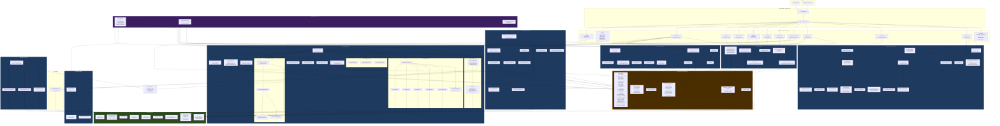

t# Finwise Architecture

```mermaid
graph TB
    %% ─── Clients ───────────────────────────────────────────────────────────────
    subgraph CLIENTS["Clients"]
        FE["Frontend SPA"]
        MOB["Mobile / External API"]
    end

    %% ─── API Gateway Layer ──────────────────────────────────────────────────────
    subgraph GATEWAY["API Gateway  ·  Spring Security"]
        JWT["JwtAuthenticationFilter\n+ JwtService"]
        RATE["RateLimitingInterceptor"]
    end

    FE & MOB --> JWT --> RATE

    %% ─── REST Controllers ───────────────────────────────────────────────────────
    subgraph CONTROLLERS["REST Controllers  (Spring MVC)"]
        C_AUTH["/api/auth\nAuthController · UserController"]
        C_CFO["/api/cfo\nCFOController · BriefController\nChatController · RagController\nInsightController · EvalController"]
        C_DASH["/api/dashboard\nDashboardController"]
        C_EXP["/api/expense\nExpenseController"]
        C_INV["/api/investment\nInvestmentController"]
        C_GOAL["/api/goal\nGoalController · GoalsController"]
        C_BUD["/api/budget\nBudgetController"]
        C_DOC["/api/document\nDocumentController"]
        C_POL["/api/policy-intelligence\nPolicyIntelligenceController"]
        C_MKT["/api/market\nMarketController"]
        C_CO["/api/company\nCompanyProfileController"]
        C_PORT["/api/portfolio\nPortfolioController"]
        C_ADMIN["/api/admin\nAdminUser · AdminPolicy\nAdminDoc · AdminScheduler\nAdminOverview · AdminRefData"]
    end

    RATE --> C_AUTH & C_CFO & C_DASH & C_EXP & C_INV & C_GOAL & C_BUD & C_DOC & C_POL & C_MKT & C_CO & C_PORT & C_ADMIN

    %% ─── CFO / Intelligence Core ─────────────────────────────────────────────────
    subgraph CFO["CFO Advisor Engine"]
        CFO_SVC["CFOAdvisorService\n(brief orchestration)"]
        CTX["ContextAssemblyService\n(token budgeting)"]
        INS["InsightCardService\nInsightCardRenderer\nInsightNarrationService\nConfidenceCalibrationService"]
        EVAL["InsightEvaluationService\nInsightClaim scoreboard"]
        SENT["FinancialSentimentService"]
        BEH["InvestorBehaviorService"]
        MKT_CTX["MarketContextService"]
        PERS["PersonalizedRelevanceScorer\n+ EmbeddingService"]

        subgraph INGEST["News Ingestion Pipeline"]
            NEWS_AGG["NewsAggregatorService\n(20+ RSS feeds)"]
            NEWS_CLS["NewsClassificationPipeline"]
            SYM_EXT["SymbolExtractorService\n(symbol_gazetteer.csv)"]
            CLUSTER["NewsClusteringService"]
        end

        subgraph RAG["RAG / Evidence Layer"]
            ART_SVC["ArticleEntityService"]
            EV_OUT["EventOutcomeService"]
            EV_PACK["EvidencePackService"]
        end

        subgraph LLM["LLM Strategy Router"]
            LLM_IF["LLMProvider (interface)"]
            CL["ClaudeProvider"]
            OA["OpenAIProvider"]
            OL["OllamaProvider"]
            GG["GoogleAIProvider"]
            OR["OpenRouterProvider"]
            REFINE["LlmRefinementService\n(async thread pool)"]
        end

        subgraph MACRO["Macro Intelligence"]
            MAC_SVC["MacroSeriesService\nMacroStateService\nRegimeModelService\nYieldCurveService"]
            MAC_SRC["FbilProvider · FiiDiiFlowProvider\nMospiProvider · RbiPolicyRateProvider\nRbiRateProvider"]
        end
    end

    C_CFO --> CFO_SVC
    CFO_SVC --> CTX & INS & EVAL & SENT & BEH & MKT_CTX & PERS
    CFO_SVC --> NEWS_AGG --> NEWS_CLS --> SYM_EXT & CLUSTER
    CFO_SVC --> ART_SVC & EV_OUT & EV_PACK
    CFO_SVC --> LLM_IF --> CL & OA & OL & GG & OR
    LLM_IF --> REFINE
    CFO_SVC --> MAC_SVC --> MAC_SRC

    %% ─── Portfolio Analytics Engine ──────────────────────────────────────────────
    subgraph ANALYTICS["Portfolio Analytics Engine"]
        RISK["PortfolioRiskService\nCovarianceEngine\nLedoitWolfShrinkage"]
        GARCH["GarchService\n(GARCH vol forecast)\nVarBacktestService"]
        FACTOR["FactorModelService\nFactorReturnService"]
        ATTR["AttributionService\n(Brinson-Fachler)"]
        PERF["PortfolioPerformanceService\nMoneyWeightedReturnService\nReturnSeriesService\nPortfolioValueSeriesService"]
        TECH["TechnicalAnalysisService\nStockScorecardService"]
        STRESS["StressScenarioService"]
        LIQ["LiquidityService"]
        COST["TradingCostService"]
        LOOK["LookThroughService\n(MF look-through)"]
        OPT["Options Engine\nBlackScholesService\nImpliedVolatilityService\nOptionChainService"]
        PEER["PeerUniverseService"]
        MC["MonteCarloGoalService"]
        FUND["FundamentalsService\nFundamentalTrendService\nEventStudyService"]
        STOCK_INT["StockIntelligenceService"]
        BB["BackbonePriceReader\n(bhavcopy backbone)"]
    end

    C_PORT --> PERF & RISK & ATTR
    C_GOAL --> MC
    RISK --> GARCH & FACTOR & STRESS & LIQ
    FACTOR --> BB
    ATTR --> PERF

    %% ─── Domain Modules ─────────────────────────────────────────────────────────
    subgraph DOMAIN["Domain Modules"]
        EXP_SVC["ExpenseService\nExpenseDocumentIngestionService"]
        INV_SVC["InvestmentService\nBondAnalyticsService\nCapitalGainsTaxService\nLotTrackingService\nTaxHarvestingService"]
        GOAL_SVC["GoalAnalyzerService\nMonteCarloGoalService"]
        BUD_SVC["BudgetMonitorService"]
        DOC_SVC["PdfTextExtractionService\n(PDFBox)\nDocumentParserService"]
        CO_SVC["CompanyProfileService\nCompanyBeginnerNarrationService"]
    end

    C_EXP --> EXP_SVC
    C_INV --> INV_SVC
    C_GOAL --> GOAL_SVC
    C_BUD --> BUD_SVC
    C_DOC --> DOC_SVC --> EXP_SVC
    C_CO --> CO_SVC

    %% ─── Policy Intelligence ─────────────────────────────────────────────────────
    subgraph POLICY["Policy Intelligence Engine"]
        POL_CRAWL["PolicyDocumentCrawlerService\n(RBI · SEBI · PIB)"]
        POL_CHUNK["PolicyChunkingService\n(~1800 chars, 200 overlap)"]
        POL_EMB["PolicyEmbeddingService"]
        POL_HYBRID["PolicyHybridRetriever\n(lexical + vector)"]
        POL_IMPACT["PolicyImpactExtractionService"]
        POL_DIFF["PolicyDiffService"]
        POL_TL["PolicyTimelineService"]
        POL_FALSE["PolicyFalsificationService"]
        POL_SEARCH["PolicySearchIndexService"]
        POL_NOTIF["PolicyNotificationService"]
    end

    C_POL --> POL_HYBRID & POL_TL & POL_IMPACT
    POL_CRAWL --> POL_CHUNK --> POL_EMB --> POL_HYBRID
    POL_CRAWL --> POL_DIFF --> POL_FALSE

    %% ─── Market Data Module ──────────────────────────────────────────────────────
    subgraph MKTDATA["Market Data Module"]
        EOD_ING["EodIngestionService\n(bhavcopy)"]
        CORP_ACT["CorporateActionService\nPriceAdjustmentService"]
        CORP_EV["CorporateEventService"]
        MF_NAV["MfNavService"]
        FILINGS["FilingsService"]
        SEED["MarketDataSeedService\nSeedValidationService"]
        GAP["GapRepairService"]
        DQ["DataQualityService"]
        NSE_CLI["NseApiClient\nNseArchiveClient"]
        AMFI_CLI["AmfiClient"]
    end

    C_MKT --> EOD_ING & CORP_ACT & MF_NAV
    EOD_ING --> NSE_CLI
    MF_NAV --> AMFI_CLI
    CORP_ACT --> NSE_CLI

    %% ─── Price Data Providers ────────────────────────────────────────────────────
    subgraph PRICE["Resilient Price Layer"]
        P_RES["ResilientPriceDataProvider\n(primary + fallback chain)"]
        P_YF["YahooFinancePriceProvider"]
        P_AV["AlphaVantagePriceProvider"]
        P_NSE["NSEIndiaPriceProvider\n+ NseSessionManager"]
    end

    P_RES --> P_YF & P_AV & P_NSE

    %% ─── Groww Integration ────────────────────────────────────────────────────────
    subgraph GROWW["Groww Integration"]
        GW_CON["GrowwConnector\n(holdings + txns)"]
        GW_AUTH["GrowwAuthService\n(token refresh)"]
        MF_IMP["MfPortfolioImportService"]
    end

    GW_CON --> GW_AUTH

    %% ─── Schedulers ──────────────────────────────────────────────────────────────
    subgraph SCHED["Schedulers (IST cron)"]
        CFO_SCHED["CFOScheduler\n07:00 news fetch\n07:15 Groww sync\n07:30 morning brief\n09-15 intraday refresh\n15:30/17:00 close brief"]
        MKT_SCHED["MarketDataScheduler\n(EOD bhavcopy, MF NAV,\ncorp actions, filings)"]
        POL_SCHED["PolicyIntelligenceScheduler\n(daily crawl)"]
    end

    CFO_SCHED --> CFO_SVC & GW_CON & NEWS_AGG
    MKT_SCHED --> EOD_ING & MF_NAV & CORP_ACT & FILINGS
    POL_SCHED --> POL_CRAWL

    %% ─── Notifications ───────────────────────────────────────────────────────────
    subgraph NOTIFY["Notifications"]
        EMAIL["EmailNotificationService\n(Gmail SMTP)"]
    end

    CFO_SVC --> EMAIL
    POL_NOTIF --> EMAIL

    %% ─── Dashboard ───────────────────────────────────────────────────────────────
    C_DASH --> EXP_SVC & INV_SVC & GOAL_SVC & BUD_SVC & CFO_SVC & RISK

    %% ─── Data Store ──────────────────────────────────────────────────────────────
    subgraph DB["PostgreSQL (JPA / Hibernate)"]
        DB_USER["users · auth_tokens"]
        DB_CFO["news_articles · news_clusters\nai_insights · insight_cards\ninsight_claims · event_outcomes\narticle_entities · evidence_items\nmacro_series · macro_snapshots\nmarket_events · computations\nportfolio_snapshots · user_profiles\nrisk_questionnaires · vol_forecasts\nfactor_risk_reports · var_backtest\nstock_fundamentals · quarterly_fundamentals\nstock_scorecard_snapshots · stock_price_history\ntechnical_snapshots · attribution_reports\nliquidity_reports · dismissed_insight_cards\ninvestor_behavior_profiles · mf_portfolio_holdings"]
        DB_FIN["expenses · investments · portfolios\nfinancial_goals · budgets\ndocument_uploads"]
        DB_POL["policy_documents · policy_chunks\npolicy_impacts · policy_changes\npolicy_versions · policy_falsification"]
        DB_MKT["instruments · eod_prices · index_eod\ncorporate_actions · corporate_events\nannouncements · market_deals\nmf_schemes · mf_nav · price_adjustments\nshare_holding_patterns · ingestion_runs"]
        DB_CO["company_profiles"]
    end

    EXP_SVC & INV_SVC & GOAL_SVC & BUD_SVC --> DB_FIN
    CFO_SVC & INS & EVAL & MACRO --> DB_CFO
    EOD_ING & CORP_ACT & MF_NAV & FILINGS --> DB_MKT
    POL_CRAWL & POL_CHUNK & POL_EMB --> DB_POL
    CO_SVC --> DB_CO
    C_AUTH --> DB_USER

    %% ─── External Services ───────────────────────────────────────────────────────
    subgraph EXTERNAL["External Services"]
        EXT_LLM["Anthropic Claude API\nOpenAI API\nGoogle AI API\nOpenRouter API\nOllama (local)"]
        EXT_PRICE["Yahoo Finance API\nAlpha Vantage API\nNSE India (scrape)"]
        EXT_GROWW["Groww API\n(holdings / txns)"]
        EXT_NSE["NSE Archive\n(bhavcopy ZIPs)"]
        EXT_AMFI["AMFI NAV service"]
        EXT_MACRO["RBI portal\nFBIL (rates)\nMOSPI (data.gov.in)\nFII/DII BSE feeds"]
        EXT_POLICY["RBI · SEBI · PIB\n(web crawl)"]
        EXT_MAIL["Gmail SMTP"]
        EXT_RSS["20+ RSS Feeds\n(ET · Moneycontrol · etc.)"]
    end

    CL --> EXT_LLM
    OA --> EXT_LLM
    GG --> EXT_LLM
    OR --> EXT_LLM
    OL --> EXT_LLM
    P_YF & P_AV & P_NSE --> EXT_PRICE
    GW_CON --> EXT_GROWW
    NSE_CLI --> EXT_NSE
    AMFI_CLI --> EXT_AMFI
    MAC_SRC --> EXT_MACRO
    POL_CRAWL --> EXT_POLICY
    EMAIL --> EXT_MAIL
    NEWS_AGG --> EXT_RSS

    %% ─── Cache ───────────────────────────────────────────────────────────────────
    CACHE["Spring Cache (CacheManager)\nstock prices · macro snapshots\nscorecard snapshots"]
    P_RES & MAC_SVC --> CACHE

    %% ─── Styling ─────────────────────────────────────────────────────────────────
    classDef module fill:#1e3a5f,stroke:#4a90d9,color:#fff
    classDef external fill:#2d4a1e,stroke:#6aaa3a,color:#fff
    classDef db fill:#4a2e00,stroke:#d4860a,color:#fff
    classDef sched fill:#3a1e5f,stroke:#9a4ad9,color:#fff

    class CFO,ANALYTICS,DOMAIN,POLICY,MKTDATA,PRICE,GROWW module
    class EXTERNAL external
    class DB db
    class SCHED sched
```